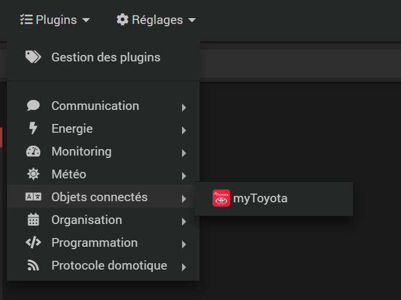
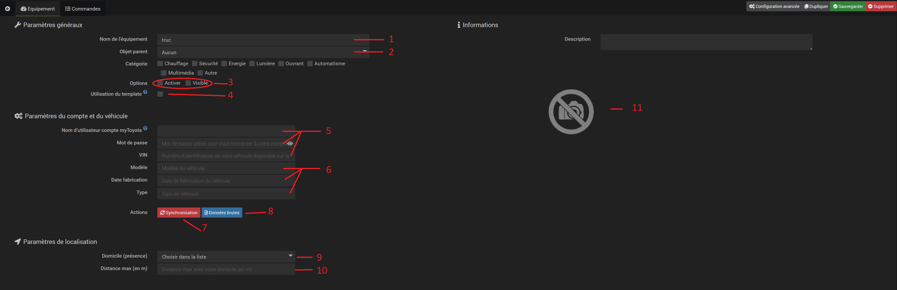
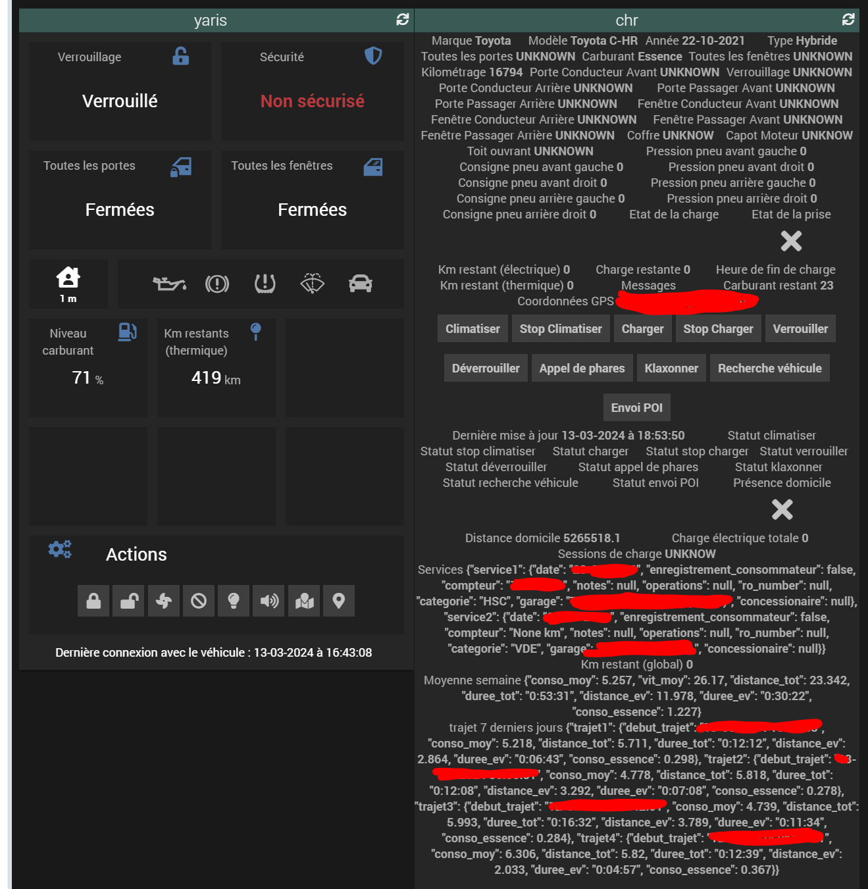
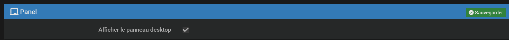
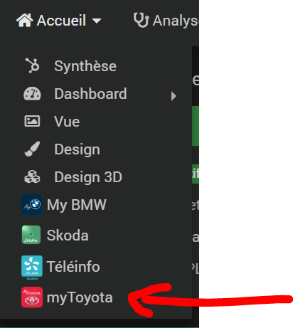
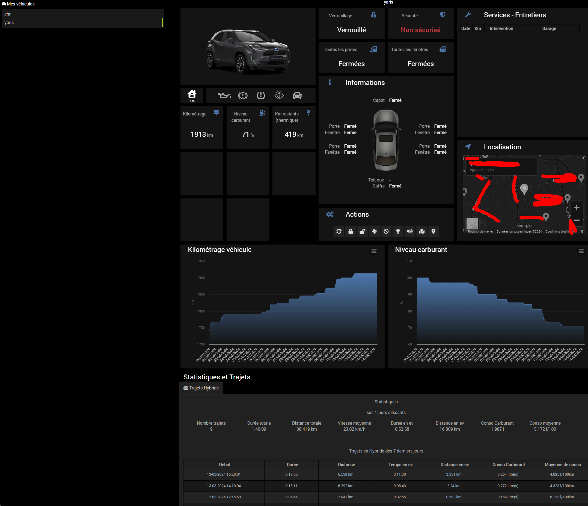

# Plugin myToyota

Fonctionnel mais pourra être développé car je n'ai pas toutes les sortes de véhicules à disposition

Il reste encore quelques finitions: l’écriture de la doc (en cours ici même) et la partie trajets affichés sur une carte (si possible). 

Précision pour l’installation, après avoir installé puis activé le plugin, attendre la fin de l'installtion des dépendances, une fois terminés lorsque vous allez créer votre équipement il est nécessaire de cliquer sur le bouton « synchroniser » pour initialiser certains paramètres puis sauvegarder. Si vous ne connaissez pas le VIN de votre véhicule, tapez n’importe quoi et allez dans les fichiers de logs, vous verrez apparaitre tous les VIN des véhicules associés à votre compte. Une fois tout paramétré les données sont mises à jour toutes les 30 minutes

1, 2 et 3: besoin d'expliquer?
4: cocher cette case si vous voulez utiliser le template fourni sur le dashboard sinon les commandes seront affichées brutes
5: compléter avec les informations qui vous permettent d'accéder à votre application myToyota (attention, ne fonctionne pas si vous êtes encore sous myT) et pour le VIN voir ci dessus
6: cette partie se remplira toute seule lorsque vous aurez cliqué sur le bouton 7
7: permet de synchroniser vos données pour la 1ère utilisation et compléter le point 6 ci dessus
8: données brutes de l'ensemble de ce qui est disponible issue du serveur Toyota pour votre véhicule, à vous de voir si dedans il y aurait des choses intéressantes que je pourrai rajouter au plugin
9: choix de la méthode pour connaitre l'emplacement de stationnement habituel de votre véhicule. Les choix de config sont "jeedom" si vous avez complété cela dans les configurations de jeedom, "position actuelle du véhicule" et "manuelle" pour saisir long et lat à la main
10: apparaitra ici la distance entre le lieux de stationnement actuel de votre véhicule et son emplacement habituel
11: apparaitra ici l'image de votre véhicule

- Dashboard

Ci dessous à gauche un équipement avec le template à droite en brut

- Panel

Si dans la configuration du plugin vous cochez "afficher le panneau desktop" alors vous verrez apparaitre une nouvelle option dans le menu accueil

ce nouveau menu ammène au panel suivant:

Merci à @Xav-74 pour son aide précieuse et la permission de reprendre l'aspect visuel de son plugin, à @OUARZA pour ses remarques pertinentes et l'aide pour le debuggage de ce plugin
